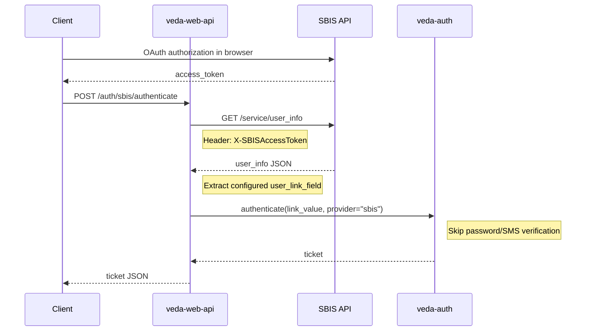

# OAuth authorization via SBIS

## Flow



## Configuration

Add to `config/veda-web-api.ini`:

```ini
[sbis]
enabled = true
base_url = https://online.sbis.ru
user_info_endpoint = /service/user_info
user_link_field = МобильныйТелефонПользователя
```

### Parameters

| Parameter | Default | Description |
|-----------|---------|-------------|
| `enabled` | `false` | Enable/disable SBIS authentication |
| `base_url` | `https://online.sbis.ru` | SBIS API base URL |
| `user_info_endpoint` | `/service/user_info` | Endpoint to get user info |
| `user_link_field` | `МобильныйТелефонПользователя` | Field name in SBIS response to link with Veda account |

### Supported link fields

- `МобильныйТелефонПользователя` - link by phone number (default)
- `ЛогинПользователя` - link by login

## API

### POST /auth/sbis/authenticate

Request:
```json
{
    "access_token": "SBIS_ACCESS_TOKEN"
}
```

Response (success):
```json
{
    "type": "ticket",
    "id": "ticket_id",
    "user_uri": "d:user_uri",
    "user_login": "79001234567",
    "result": 200,
    "end_time": 1234567890,
    "auth_method": "sbis"
}
```

Error responses return HTTP status code without body:
- `472` - Authentication failed
- `400` - Bad request

## Phone Number Normalization

When `user_link_field` is set to phone number field, the service automatically normalizes Russian phone numbers:
- Input: `79001234567` → Output: `+79001234567`
- Normalization applies only to 11-digit numbers starting with `7`

## Implementation

### veda-web-api

Module `sbis_auth.rs`:
- `SbisAuthConfig` - configuration structure with `user_link_field` option
- `SbisAuthService` - service for SBIS token verification and link value extraction
- `sbis_authenticate` - HTTP handler for `/auth/sbis/authenticate`

### veda-auth

Extended `authenticate` function with `provider` parameter:
- If `provider` is set (e.g. "sbis"), skip password/SMS verification
- Create ticket with `auth_method = provider`

### v-common

Extended `AuthClient::authenticate` with `provider: Option<&str>` parameter.
