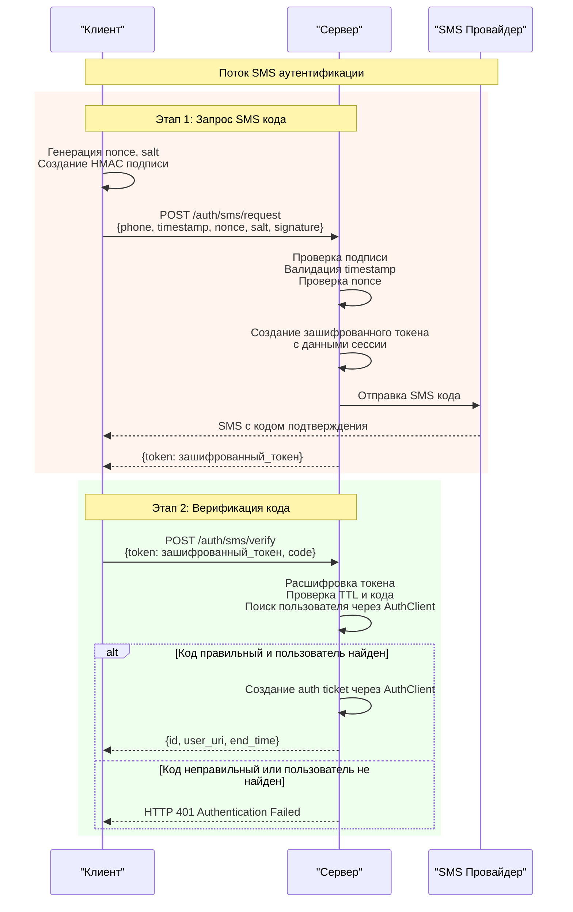

# SMS Authentication Flow Diagram

Диаграмма взаимодействия для SMS аутентификации.

## Flow Diagram


```mermaid
sequenceDiagram
    participant Client as "Клиент"
    participant Server as "Сервер" 
    participant SMS as "SMS Провайдер"
    
    note over Client, SMS: Поток SMS аутентификации
    
    rect rgb(255, 245, 238)
        note over Client, Server: Этап 1: Запрос SMS кода
        Client->>Client: Генерация nonce, salt<br/>Создание HMAC подписи
        Client->>Server: POST /auth/sms/request<br/>{phone, timestamp, nonce, salt, signature}
        
        Server->>Server: Проверка подписи<br/>Валидация timestamp<br/>Проверка nonce
        Server->>Server: Создание зашифрованного токена<br/>с данными сессии
        Server->>SMS: Отправка SMS кода
        SMS-->>Client: SMS с кодом подтверждения
        Server-->>Client: {token: зашифрованный_токен}
    end
    
    rect rgb(238, 255, 238)
        note over Client, Server: Этап 2: Верификация кода
        Client->>Server: POST /auth/sms/verify<br/>{token: зашифрованный_токен, code}
        
        Server->>Server: Расшифровка токена<br/>Проверка TTL и кода<br/>Поиск пользователя через AuthClient
        alt Код правильный и пользователь найден
            Server->>Server: Создание auth ticket через AuthClient
            Server-->>Client: {id, user_uri, end_time}
        else Код неправильный или пользователь не найден
            Server-->>Client: HTTP 401 Authentication Failed
        end
    end
```

## Implementation Details

### HMAC Signature Calculation
```
message = "action=sms_request|nonce={nonce}|phone={phone}|salt={salt}|timestamp={timestamp}"
signature = HMAC-SHA256(message, client_secret + salt)
```

### Session Management
- **Session storage**: Stateless - данные зашифрованы в токене
- **Session TTL**: 5 minutes (configurable) 
- **Max attempts**: 3 tries per session

### Rate Limiting
- **Per phone**: 5 SMS per hour
- **Per IP**: 20 SMS per hour
- **Per session**: 3 verification attempts

## Error Handling

| Error Case | HTTP Status | Client Action |
|------------|-------------|---------------|
| Invalid signature | 400 | Show generic error |
| Phone not registered | 401 | Show authentication failed |
| Rate limited | 429 | Show retry timer |
| Session expired | 400 | Restart flow |
| Invalid code | 400 | Allow retry (max 3) |

## Testing

Используйте номера телефонов, зарегистрированные в системе через AuthClient.

Logs will show generated SMS codes during development.
