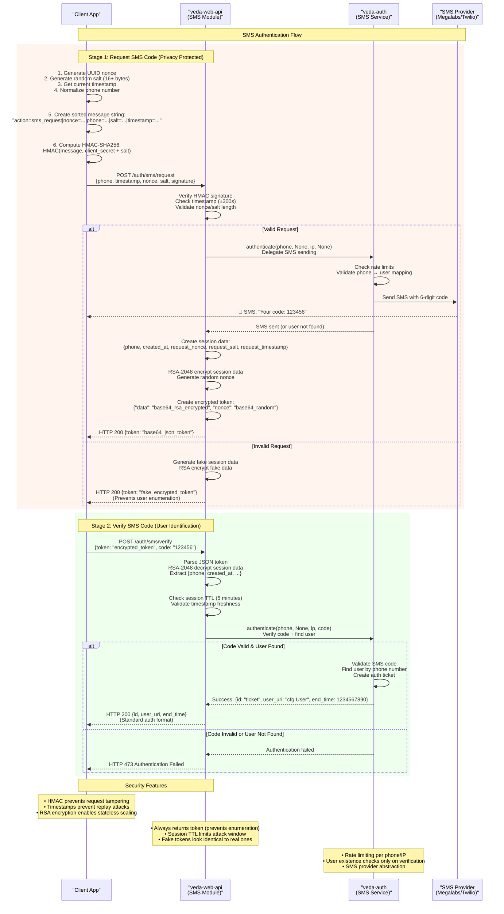

# SMS Authentication Flow Diagram

Interaction diagram for SMS authentication with veda-auth integration and RSA encryption.

## Flow Diagram


```mermaid
sequenceDiagram
    participant Client as "Client App"
    participant WebAPI as "veda-web-api<br/>(SMS Module)" 
    participant VedaAuth as "veda-auth<br/>(SMS Service)"
    participant SMSProvider as "SMS Provider<br/>(Megalabs/Twilio)"
    
    note over Client, SMSProvider: SMS Authentication Flow
    
    rect rgb(255, 245, 238)
        note over Client, WebAPI: Stage 1: Request SMS Code (Privacy Protected)
        
        Client->>Client: 1. Generate UUID nonce<br/>2. Generate random salt (16+ bytes)<br/>3. Get current timestamp<br/>4. Normalize phone number
        Client->>Client: 5. Create sorted message string:<br/>"action=sms_request|nonce=...|phone=...|salt=...|timestamp=..."
        Client->>Client: 6. Compute HMAC-SHA256:<br/>HMAC(message, client_secret + salt)
        
        Client->>WebAPI: POST /auth/sms/request<br/>{phone, timestamp, nonce, salt, signature}
        
        WebAPI->>WebAPI: Verify HMAC signature<br/>Check timestamp (±300s)<br/>Validate nonce/salt length
        
        alt Valid Request
            WebAPI->>VedaAuth: authenticate(phone, None, ip, None)<br/>Delegate SMS sending
            VedaAuth->>VedaAuth: Check rate limits<br/>Validate phone → user mapping
            VedaAuth->>SMSProvider: Send SMS with 6-digit code
            SMSProvider-->>Client: 📱 SMS: "Your code: 123456"
            VedaAuth-->>WebAPI: SMS sent (or user not found)
            
            WebAPI->>WebAPI: Create session data:<br/>{phone, created_at, request_nonce, request_salt, request_timestamp}
            WebAPI->>WebAPI: RSA-2048 encrypt session data<br/>Generate random nonce
            WebAPI->>WebAPI: Create encrypted token:<br/>{"data": "base64_rsa_encrypted", "nonce": "base64_random"}
            WebAPI-->>Client: HTTP 200 {token: "base64_json_token"}
        else Invalid Request  
            WebAPI->>WebAPI: Generate fake session data<br/>RSA encrypt fake data
            WebAPI-->>Client: HTTP 200 {token: "fake_encrypted_token"}<br/>(Prevents user enumeration)
        end
    end
    
    rect rgb(238, 255, 238)
        note over Client, WebAPI: Stage 2: Verify SMS Code (User Identification)
        
        Client->>WebAPI: POST /auth/sms/verify<br/>{token: "encrypted_token", code: "123456"}
        
        WebAPI->>WebAPI: Parse JSON token<br/>RSA-2048 decrypt session data<br/>Extract {phone, created_at, ...}
        WebAPI->>WebAPI: Check session TTL (5 minutes)<br/>Validate timestamp freshness
        
        WebAPI->>VedaAuth: authenticate(phone, None, ip, code)<br/>Verify code + find user
        
        alt Code Valid & User Found
            VedaAuth->>VedaAuth: Validate SMS code<br/>Find user by phone number<br/>Create auth ticket
            VedaAuth-->>WebAPI: Success: {id: "ticket", user_uri: "cfg:User", end_time: 1234567890}
            WebAPI-->>Client: HTTP 200 {id, user_uri, end_time}<br/>(Standard auth format)
        else Code Invalid or User Not Found
            VedaAuth-->>WebAPI: Authentication failed
            WebAPI-->>Client: HTTP 473 Authentication Failed
        end
    end
    
    note over Client, WebAPI: Security Features
    note over Client: • HMAC prevents request tampering<br/>• Timestamps prevent replay attacks<br/>• RSA encryption enables stateless scaling
    note over WebAPI: • Always returns token (prevents enumeration)<br/>• Session TTL limits attack window<br/>• Fake tokens look identical to real ones
    note over VedaAuth: • Rate limiting per phone/IP<br/>• User existence checks only on verification<br/>• SMS provider abstraction
```

## Implementation Details

### HMAC Signature Calculation
**Message Format (alphabetically sorted fields):**
```
message = "action=sms_request|nonce={uuid}|phone={normalized}|salt={hex}|timestamp={unix_seconds}"
signature = HMAC-SHA256(message, client_secret + salt)
```

**Example:**
```
message = "action=sms_request|nonce=550e8400-e29b-41d4-a716-446655440000|phone=79991234567|salt=abcdef1234567890|timestamp=1703123456"
key = "veda-sms-secret-key-2024-secure" + "abcdef1234567890"
signature = hmac_sha256(message, key) = "a1b2c3..." (64 hex chars)
```

### RSA Session Token Management
**Token Structure:**
```json
{
    "data": "base64_rsa_2048_encrypted_session_data",
    "nonce": "base64_16_byte_random_nonce"
}
```

**Encrypted Session Data:**
```json
{
    "phone": "79991234567",
    "created_at": 1703123456,
    "request_nonce": "original_uuid_nonce",
    "request_salt": "original_hex_salt", 
    "request_timestamp": 1703123456
}
```

**Security Features:**
- **RSA-2048 encryption**: Generated at startup or loaded from file
- **Session TTL**: 5 minutes (300 seconds)
- **Replay protection**: Original request nonce/salt/timestamp included
- **Stateless scaling**: No server-side session storage required

### Rate Limiting Architecture
**Delegation to veda-auth:**
- SMS codes per phone number per hour
- SMS codes per IP address per hour  
- Maximum verification attempts per session
- No local rate limiting in web API module

**Provider Configuration:**
- SMS providers (Megalabs, Twilio, etc.) configured in veda-auth
- Phone-to-user mappings managed in veda-auth database
- Rate limiting policies defined in veda-auth

## Error Handling

### Request Stage (`/auth/sms/request`)
| Error Case | HTTP Status | Response | Client Action |
|------------|-------------|----------|---------------|
| Valid request | 200 | Real encrypted token | Proceed to verification |
| Invalid signature | 200 | Fake encrypted token | Show "code sent" message |
| Malformed JSON | 400 | Error response | Show input validation error |
| Missing fields | 400 | Error response | Show field requirements |
| Timestamp expired | 200 | Fake encrypted token | Show "code sent" message |

### Verification Stage (`/auth/sms/verify`)
| Error Case | HTTP Status | Response | Client Action |
|------------|-------------|----------|---------------|
| Valid code | 200 | Auth ticket | Store ticket, proceed |
| Invalid code | 473 | Auth failed | Allow retry (max 3) |
| Session expired | 473 | Auth failed | Restart entire flow |
| Invalid token | 400 | Bad request | Restart entire flow |
| User not found | 473 | Auth failed | Show auth failed message |

**Privacy Protection:** Request stage always returns HTTP 200 with a token to prevent phone number enumeration.

## Testing

### Development Setup
**Prerequisites:**
- veda-auth instance running and accessible
- Test phone numbers registered in veda-auth user database
- SMS provider configured in veda-auth (or test mode)
- Matching `client_secret` in web API and test client
- RSA keys generated (automatic) or loaded from file

**Test Configuration:**
```ini
# sms_auth.ini
[sms]
enabled = true
client_secret = test-secret-key-2024
max_time_drift = 300
# rsa_key_path = # Auto-generated for testing
```

**Development SMS Codes:**
- Check veda-auth logs for development/test codes
- Configure test SMS provider in veda-auth for development
- Use registered test phone numbers (e.g., 79999999999)

### Testing Commands
```bash
# 1. Verify SMS endpoints are available
curl -X POST http://localhost:8080/auth/sms/request \
  -H "Content-Type: application/json" \
  -d '{}'
# Expected: 400 Bad Request (missing fields)

# 2. Check veda-auth connectivity
RUST_LOG=veda_web_api=debug cargo run
# Look for: "SMS service initialized with RSA encryption"

# 3. Test with valid signature (use test client)
node test_sms_client.js
```

### Integration Testing
```javascript
// Flow test
async function testSmsFlow() {
    // 1. Generate signed request
    const request = createSignedSmsRequest('79999999999', 'test-secret-key-2024');
    
    // 2. Request SMS
    const response = await fetch('/auth/sms/request', {
        method: 'POST',
        headers: { 'Content-Type': 'application/json' },
        body: JSON.stringify(request)
    });
    
    const { token } = await response.json();
    console.log('Token received:', token);
    
    // 3. Verify with test code (check veda-auth logs)
    const verifyResponse = await fetch('/auth/sms/verify', {
        method: 'POST',
        headers: { 'Content-Type': 'application/json' },
        body: JSON.stringify({ token, code: '123456' })
    });
    
    const authResult = await verifyResponse.json();
    console.log('Auth result:', authResult);
}
```
