# SMS Authentication Flow Diagram

Interaction diagram for SMS authentication with veda-auth integration and RSA encryption.

## Flow Diagram

```mermaid
sequenceDiagram
    participant Client as "Client App"
    participant WebAPI as "veda-web-api<br/>(SMS Module)" 
    participant VedaAuth as "veda-auth<br/>(SMS Service)"
    participant SMSProvider as "SMS Provider<br/>(External API)"
    
    note over Client, SMSProvider: SMS Authentication Flow
    
    rect rgb(255, 245, 238)
        note over Client, WebAPI: Stage 1: Request SMS Code (Privacy Protected)
        
        Client->>Client: 1. Generate UUID nonce<br/>2. Generate random salt (16+ bytes)<br/>3. Get current timestamp<br/>4. Normalize phone number
        Client->>Client: 5. Create sorted message string:<br/>"action=sms_request|nonce=...|phone=...|salt=...|timestamp=..."
        Client->>Client: 6. Compute HMAC-SHA256:<br/>HMAC(message, client_secret + salt)
        
        Client->>WebAPI: POST /auth/sms/request<br/>{phone, timestamp, nonce, salt, signature}
        
        WebAPI->>WebAPI: Verify HMAC signature<br/>Check timestamp (±300s)<br/>Validate nonce/salt length
        
        alt Valid Request
            WebAPI->>VedaAuth: authenticate(phone, None, ip, None)<br/>Delegate SMS sending
            VedaAuth->>VedaAuth: Check rate limits<br/>Validate phone → user mapping
            VedaAuth->>SMSProvider: Send SMS with 6-digit code
            SMSProvider-->>Client: 📱 SMS: "Your code: 123456"
            VedaAuth-->>WebAPI: SMS sent (or user not found)
            
            WebAPI->>WebAPI: Create session data:<br/>{phone, created_at, request_nonce, request_salt, request_timestamp}
            WebAPI->>WebAPI: RSA-2048 encrypt session data<br/>Generate random nonce
            WebAPI->>WebAPI: Create encrypted token:<br/>{"data": "base64_rsa_encrypted", "nonce": "base64_random"}
            WebAPI-->>Client: HTTP 200 {token: "base64_json_token"}
        else Invalid Request  
            WebAPI->>WebAPI: Generate fake session data<br/>RSA encrypt fake data
            WebAPI-->>Client: HTTP 200 {token: "fake_encrypted_token"}<br/>(Prevents user enumeration)
        end
    end
    
    rect rgb(238, 255, 238)
        note over Client, WebAPI: Stage 2: Verify SMS Code (User Identification)
        
        Client->>WebAPI: POST /auth/sms/verify<br/>{token: "encrypted_token", code: "123456"}
        
        WebAPI->>WebAPI: Parse JSON token<br/>RSA-2048 decrypt session data<br/>Extract {phone, created_at, ...}
        WebAPI->>WebAPI: Check session TTL (5 minutes)<br/>Validate timestamp freshness
        
        WebAPI->>VedaAuth: authenticate(phone, None, ip, code)<br/>Verify code + find user
        
        alt Code Valid & User Found
            VedaAuth->>VedaAuth: Validate SMS code<br/>Find user by phone number<br/>Create auth ticket
            VedaAuth-->>WebAPI: Success: {id: "ticket", user_uri: "cfg:User", end_time: 1234567890}
            WebAPI-->>Client: HTTP 200 {id, user_uri, end_time}<br/>(Standard auth format)
        else Code Invalid or User Not Found
            VedaAuth-->>WebAPI: Authentication failed
            WebAPI-->>Client: HTTP 473 Authentication Failed
        end
    end
    
    note over Client, WebAPI: Security Features
    note over Client: • HMAC prevents request tampering<br/>• Timestamps prevent replay attacks<br/>• RSA encryption enables stateless scaling
    note over WebAPI: • Always returns token (prevents enumeration)<br/>• Session TTL limits attack window<br/>• Fake tokens look identical to real ones
    note over VedaAuth: • Rate limiting per phone/IP<br/>• User existence checks only on verification<br/>• SMS provider abstraction
```



## Implementation Details

### HMAC Signature Calculation
**Message Format (alphabetically sorted fields):**
```
message = "action=sms_request|nonce={uuid}|phone={normalized}|salt={hex}|timestamp={unix_seconds}"
signature = HMAC-SHA256(message, client_secret + salt)
```

**Example:**
```
message = "action=sms_request|nonce=550e8400-e29b-41d4-a716-446655440000|phone=79991234567|salt=abcdef1234567890|timestamp=1703123456"
key = "your-secret-key-here" + "abcdef1234567890"
signature = hmac_sha256(message, key) = "a1b2c3..." (64 hex chars)
```

### RSA Session Token Management
**Token Structure:**
```json
{
    "data": "base64_rsa_2048_encrypted_session_data",
    "nonce": "base64_16_byte_random_nonce"
}
```

**Encrypted Session Data:**
```json
{
    "phone": "79991234567",
    "created_at": 1703123456,
    "request_nonce": "original_uuid_nonce",
    "request_salt": "original_hex_salt", 
    "request_timestamp": 1703123456
}
```

**Security Features:**
- **RSA-2048 encryption**: Generated at startup or loaded from file
- **Session TTL**: 5 minutes (300 seconds)
- **Replay protection**: Original request nonce/salt/timestamp included
- **Stateless scaling**: No server-side session storage required

### Rate Limiting Architecture
**Delegation to veda-auth:**
- SMS codes per phone number per hour
- SMS codes per IP address per hour  
- Maximum verification attempts per session
- No local rate limiting in web API module

**Provider Configuration:**
- SMS providers configured in veda-auth
- Phone-to-user mappings managed in veda-auth database
- Rate limiting policies defined in veda-auth

## Error Handling

### Request Stage (`/auth/sms/request`)
| Error Case | HTTP Status | Response | Client Action |
|------------|-------------|----------|---------------|
| Valid request | 200 | Real encrypted token | Proceed to verification |
| Invalid signature | 200 | Fake encrypted token | Show "code sent" message |
| Rate limited | 200 | Fake encrypted token | Show "code sent" message |
| Any other error | 200 | Fake encrypted token | Show "code sent" message |
| Timestamp expired | 200 | Fake encrypted token | Show "code sent" message |

### Verification Stage (`/auth/sms/verify`)
| Error Case | HTTP Status | Response | Client Action |
|------------|-------------|----------|---------------|
| Valid code | 200 | Auth ticket | Store ticket, proceed |
| Invalid code | 473 | Auth failed | Allow retry (max 3) |
| Session expired | 473 | Auth failed | Restart entire flow |
| Invalid token | 400 | Bad request | Restart entire flow |
| User not found | 473 | Auth failed | Show auth failed message |

**Privacy Protection:** Request stage always returns HTTP 200 with a token to prevent phone number enumeration. No validation errors (400) are returned at request stage to avoid information leakage.

## Testing

### Development Setup
**Prerequisites:**
- veda-auth instance running and accessible
- Test phone numbers registered in veda-auth user database
- SMS provider configured in veda-auth (or test mode)
- Matching `client_secret` in web API and test client
- RSA keys generated (automatic) or loaded from file

**Test Configuration:**
```ini
# config/veda-web-api.ini
[sms]
enabled = true
client_secret = your-test-secret-key
max_time_drift = 300
# rsa_key_path = # Auto-generated for testing
```

**Development SMS Codes:**
- Check veda-auth logs for development/test codes
- Configure test SMS provider in veda-auth for development
- Use registered test phone numbers (e.g., 79999999999)

### Testing Commands
```bash
# 1. Verify SMS endpoints are available
curl -X POST http://localhost:8080/auth/sms/request \
  -H "Content-Type: application/json" \
  -d '{}'
# Expected: 200 OK with fake token (prevents enumeration)

# 2. Check veda-auth connectivity
RUST_LOG=veda_web_api=debug cargo run
# Look for: "SMS service initialized with RSA encryption"

# 3. Test with valid signature (use test client)
node test_sms_client.js
```

### Integration Testing
```javascript
// Flow test
async function testSmsFlow() {
    // 1. Generate signed request
    const request = createSignedSmsRequest('79999999999', 'your-test-secret-key');
    
    // 2. Request SMS
    const response = await fetch('/auth/sms/request', {
        method: 'POST',
        headers: { 'Content-Type': 'application/json' },
        body: JSON.stringify(request)
    });
    
    const { token } = await response.json();
    console.log('Token received:', token);
    
    // 3. Verify with test code (check veda-auth logs)
    const verifyResponse = await fetch('/auth/sms/verify', {
        method: 'POST',
        headers: { 'Content-Type': 'application/json' },
        body: JSON.stringify({ token, code: '123456' })
    });
    
    const authResult = await verifyResponse.json();
    console.log('Auth result:', authResult);
}
```

---

# Complete SMS Authentication Architecture

## System Components

SMS authentication in the Veda system is implemented through interaction of four main components:

### 🌐 **veda-web-api** - HTTP API Gateway
**Location:** `~/work/veda-server/source/veda-web-api`
**Main Functions:**
- Handle HTTP requests from client applications
- HMAC validation of requests with replay attack protection
- RSA-2048 encryption/decryption of session data
- Delegate authentication to veda-auth via NNG protocol
- Protect against user enumeration via fake tokens

### 🔐 **veda-auth** - Central Authentication Server  
**Location:** `~/work/veda-server/source/veda-auth`
**Main Functions:**
- Determine authentication type (SMS vs password)
- Generate and validate 6-digit SMS codes
- Rate limiting (60 seconds between requests, 5 SMS per day)
- Manage users and tickets
- Create v-s:Sms individuals for queue processing

### 📨 **veda-sms-sender** - SMS Queue Processor
**Location:** `~/work/veda-server/source/veda-sms-sender`
**Main Functions:**
- Monitor `individuals-flow` queue
- Access control via system ticket verification
- Integration with SMS Provider API
- Synchronous SMS sending with status updates
- Protection against infinite loops via event_id

### 📱 **SMS Provider API** - External SMS Service
**Functions:**
- Actual SMS message delivery
- Handle phone numbers for target regions
- Return delivery status reports

## Detailed Architecture Diagram


## Enterprise-Level Security

### 🛡️ Multi-Layer Protection

**1. HTTP API Layer (veda-web-api)**
```rust
// HMAC signature with dynamic salt
let message = "action=sms_request|nonce=uuid|phone=79991234567|salt=hex|timestamp=unix";
let signature = hmac_sha256(message, client_secret + salt);

// RSA-2048 session encryption with OAEP padding
let encrypted_session = rsa_public_key.encrypt(&session_data);
```

**2. Access Control (veda-sms-sender)**
```rust
// CRITICAL system ticket verification
if user_uri != self.sys_ticket.user_uri {
    info!("SMS request rejected: user {} does not have sys_ticket", user_uri);
    return Ok(false);
}
```

**3. Rate Limiting (veda-auth)**
- 60 seconds between SMS requests per number
- Maximum 5 SMS per day per user  
- Auto-lockout after multiple failures
- Session TTL of 5 minutes

**4. Attack Protection**
- **Replay Protection**: UUID nonce + timestamps ±300s
- **User Enumeration**: Always returns HTTP 200 with token
- **Brute Force**: Rate limiting + auto-lockout
- **Session Hijacking**: RSA encryption + short TTL

### 🔐 Cryptographic Algorithms

| Algorithm | Purpose | Parameters |
|-----------|---------|------------|
| HMAC-SHA256 | Request signing | client_secret + dynamic salt |
| RSA-2048 | Session encryption | OAEP padding, auto-generated keys |
| SHA256 | RSA key fingerprint | For debugging and logging |
| UUID v4 | Nonce generation | Replay attack protection |

## System Configuration

### veda-web-api: `config/veda-web-api.ini`
```ini
[sms]
enabled = true
client_secret = your-secret-key-here    # HMAC key (32+ characters)
max_time_drift = 300                               # ±5 minutes drift
rsa_key_path = /etc/veda/rsa_private_key.pem      # Optional for clusters
```

### veda-sms-sender: `config/veda-sms-sender.ini`
```ini
[sms_provider]
provider = your_sms_provider                  # Provider type
server = https://your-provider.com/api/v1/sms # API URL
user = your_api_username                      # API username
password = your_api_password                  # API password
from = YOUR_SENDER_NAME                       # Sender name
message_size_limit = 500                      # SMS character limit
```

### veda-auth: Database Parameters
```
cfg:sms_rate_limit_period = "60s"        # Period between requests
cfg:sms_daily_limit = 5                  # SMS per day per user
cfg:sms_code_min = 100000               # Minimum SMS code
cfg:sms_code_max = 999999               # Maximum SMS code  
cfg:secret_lifetime = 21600             # Code lifetime (6 hours)
cfg:failed_auth_attempts = 2            # Attempts before lockout
cfg:failed_auth_lock_period = 1800      # Lockout time (30 minutes)
```

## Data Flows and Protocols

### Inter-Module Communications
1. **Browser ↔ veda-web-api**: HTTPS + JSON (HMAC-protected requests)
2. **veda-web-api ↔ veda-auth**: NNG protocol + JSON (internal network)
3. **veda-auth → individuals-flow**: v-s:Sms individual queue
4. **veda-sms-sender ← individuals-flow**: Queue monitoring with access control
5. **veda-sms-sender → SMS Provider**: HTTPS + JSON + Authentication

### Data Formats

**SMS Individual in Queue:**
```json
{
  "@": "d:sms_1703123456789",
  "rdf:type": [{"type": "Uri", "data": "v-s:Sms"}],
  "v-s:recipientPhone": [{"type": "String", "data": "79991234567"}],
  "v-s:messageBody": [{"type": "String", "data": "Your login code: 123456. Do not share with anyone."}],
  "v-s:created": [{"type": "Datetime", "data": 1703123456}],
  "v-s:isSuccess": [{"type": "Boolean", "data": false}],
  "v-s:infoOfExecuting": [{"type": "String", "data": ""}]
}
```

**SMS Provider API Request:**
```json
{
  "from": "COMPANY_NAME",
  "to": 79991234567,
  "message": "Your login code: 123456. Do not share with anyone."
}
```

## Monitoring and Logging

### Key Metrics
- **SMS Response Time**: Time from request to actual sending
- **Delivery Success Rate**: Percentage of successful deliveries via SMS Provider
- **Rate Limiting Triggers**: Number of blocked requests  
- **RSA Operations**: Session encryption/decryption time
- **System Tickets**: Rejected requests without sys_ticket

### Critical Log Messages
```bash
# veda-web-api
INFO SMS service initialized with RSA encryption, key fingerprint: a1b2c3d4
INFO SMS request processed for 79991234567 from 127.0.0.1
ERROR SMS request failed: Invalid signature from 127.0.0.1

# veda-auth  
INFO SMS auth code requested for 79991234567
WARN Rate limit exceeded for phone 79991234567
INFO SMS code verification successful for 79991234567

# veda-sms-sender
INFO SMS request rejected: user cfg:Guest does not have sys_ticket
INFO SMS sent successfully: {"result":{"status":{"code":0}}}
ERROR Failed to send SMS request: Connection timeout
```

## Production Deployment

### System Requirements
- **veda-web-api**: HTTP server, RSA keys, HMAC configuration
- **veda-auth**: NNG server, user database access, SMS configuration
- **veda-sms-sender**: Queue access, system ticket, SMS Provider API
- **Network**: HTTPS for external requests, secure inter-module communication

### Security Checklist
- [ ] Unique `client_secret` with 32+ characters  
- [ ] RSA keys generated and configured for cluster
- [ ] SMS Provider API credentials in secure configuration
- [ ] HTTPS configured for all external endpoints
- [ ] Rate limiting parameters tuned to business requirements
- [ ] Security logs and metrics monitoring
- [ ] System tickets configured with minimal privileges

### Scaling
- **Horizontal**: Multiple veda-web-api instances with identical RSA keys
- **Vertical**: Increase workers for HTTP processing
- **Queues**: Multiple veda-sms-sender instances for parallel processing
- **Monitoring**: Centralized logging and alerting

This architecture provides **enterprise-level security, reliability, and scalability** for SMS authentication in the Veda ecosystem.
